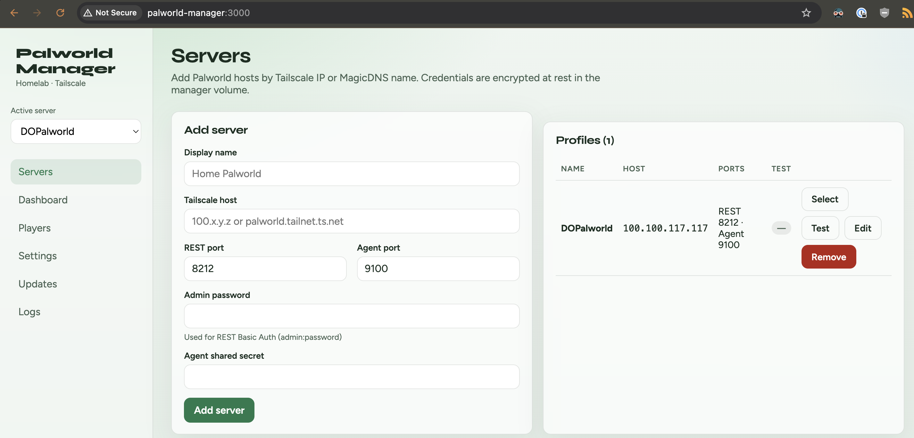
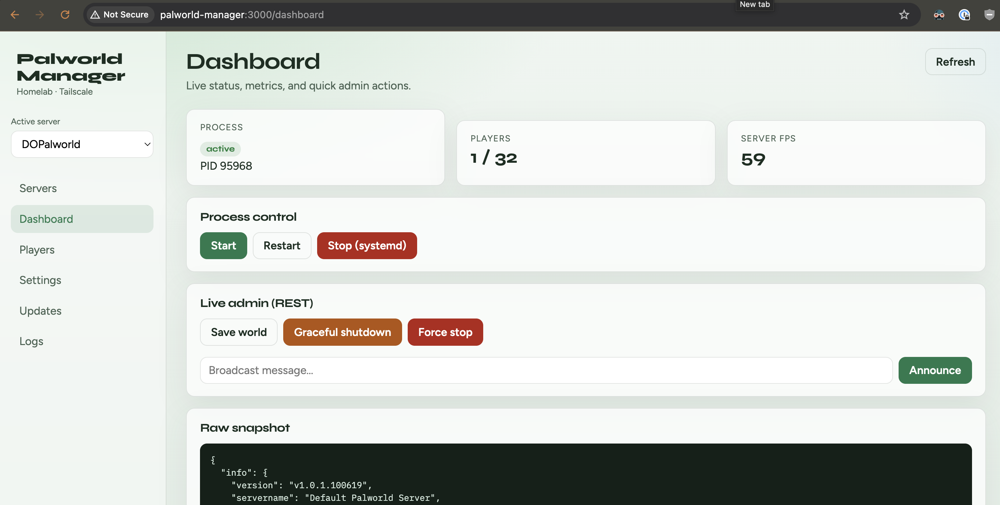
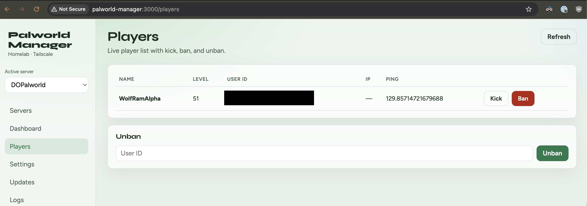
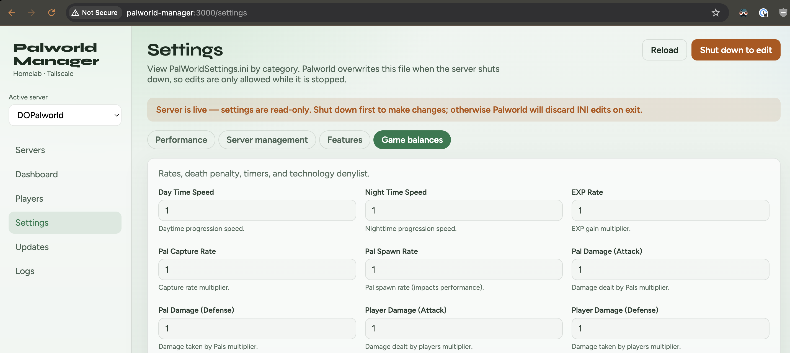
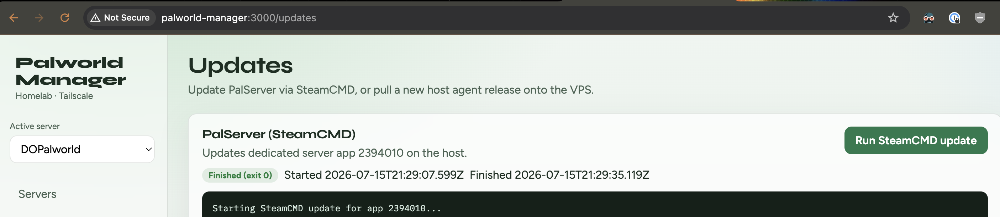

# Palworld Server Manager

Manage one or more Linux Palworld dedicated servers from a browser. The manager runs in Docker; a small agent runs on every Palworld host and controls the server, its settings, logs, and SteamCMD updates.

## Screenshots











> 🚨 **TAILSCALE ONLY — DO NOT EXPOSE THE MANAGER, AGENT, REST API, OR GAME PORTS TO THE PUBLIC INTERNET.** 🚨  
> This release has no application sign-in. Anyone who can reach the manager can operate your configured servers.

## What you need

- A Docker host for the web manager
- An Ubuntu or other systemd-based Linux host for each Palworld server
- Node.js 20 or later on each Palworld host (Node.js 22 is recommended)
- Tailscale installed and connected on the manager host, each Palworld host, and the devices that will use the manager
- A running Palworld dedicated server managed by `systemd`

The defaults below assume Palworld is installed at `/home/palworld/Steam/steamapps/common/PalServer` and its service is named `palworld.service`. Adjust paths and service names to match your installation.

## 1. Install the manager

On the Docker host, create a directory and save this as `compose.yml`:

```yaml
services:
  manager:
    image: wolframalpha12/palworld-server-manager:latest
    container_name: palworld-manager
    ports:
      - "3000:3000"
    volumes:
      - manager-data:/data
    environment:
      PSM_DATA_DIR: /data
      # Generate once with: openssl rand -hex 32
      # Keep this value permanently. Changing it prevents stored passwords from decrypting.
      PSM_ENCRYPTION_KEY: "replace-with-a-long-random-secret"
    restart: unless-stopped

volumes:
  manager-data:
```

Start it:

```bash
docker compose up -d
```

Open `http://<docker-host-tailscale-ip>:3000` from a device on your tailnet. Confirm the manager is running with:

```bash
docker compose ps
```

Keep the Docker volume and `PSM_ENCRYPTION_KEY` when upgrading or moving the manager. They contain the server profiles and the key used to encrypt their credentials.

## 2. Prepare the Palworld service

The agent controls a `systemd` service. If your server is not already managed by one, download the example unit, edit it, and start it:

```bash
sudo curl -fsSL \
  https://raw.githubusercontent.com/WolfRamAlpha12/Palworld-Server-Manager/main/deploy/systemd/palworld.service \
  -o /etc/systemd/system/palworld.service
sudoedit /etc/systemd/system/palworld.service
sudo systemctl daemon-reload
sudo systemctl enable --now palworld.service
```

In the unit, set `User=`, `Group=`, `HOME=`, `WorkingDirectory=`, and `ExecStart=` for the account and directory that own your Palworld installation. Check it before continuing:

```bash
sudo systemctl status palworld.service
```

## 3. Install and configure the host agent

On the same host as Palworld, first confirm Node.js is installed:

```bash
node --version
```

Install the latest released agent without starting it yet:

```bash
curl -fsSL \
  https://github.com/WolfRamAlpha12/Palworld-Server-Manager/releases/latest/download/install.sh \
  | sudo AGENT_SKIP_RESTART=1 bash
```

Edit the generated unit:

```bash
sudoedit /etc/systemd/system/palworld-agent.service
```

Set all of the following before starting it:

- `AGENT_SECRET` — a long, unique random secret. You will enter the same value in the manager.
- `PALWORLD_SERVICE` — normally `palworld.service`.
- `HOME`, `PALWORLD_INSTALL_ROOT`, and `STEAMCMD_PATH` — paths for your Palworld installation.

The default unit runs the agent as root so it can control `palworld.service`. Keep the agent reachable only through Tailscale. If you run it as another user, that user needs tightly scoped, passwordless permission to check and start, stop, or restart the Palworld service.

Start the agent and confirm its status:

```bash
sudo systemctl daemon-reload
sudo systemctl enable --now palworld-agent.service
sudo systemctl status palworld-agent.service
```

From the Palworld host, verify that the agent responds:

```bash
curl -H "Authorization: Bearer <your-agent-secret>" http://127.0.0.1:9100/health
```

You should receive JSON containing `"ok":true`. Repeat this section for every Palworld host you want to manage.

## 4. Add a server in the manager

1. Open the manager and go to **Servers**.
2. Enter a display name and the Palworld host's Tailscale IP or MagicDNS name.
3. Keep the default ports unless you changed them:
   - REST API: `8212`
   - Agent: `9100`
4. Enter a Palworld admin password and the exact `AGENT_SECRET` from that host's agent unit.
5. Select **Add server**, then select **Test**.

The manager stores the admin password and agent secret encrypted in its Docker volume.

## 5. Enable the Palworld REST API

For a new server, go to **Settings** in the manager, ensure the Palworld server is stopped, and save the settings. The agent writes the REST API setting, REST port, and admin password to `PalWorldSettings.ini`. Then start or restart the server from the dashboard.

Return to **Servers** and select **Test**. Both the agent and REST API should report success. If the agent works but REST fails, confirm that the Palworld service restarted after saving settings and that port `8212` is reachable over Tailscale.

## Everyday use

- **Dashboard**: view status, start, stop, restart, save, announce, and shut down a server.
- **Players**: view connected players and kick, ban, or unban them.
- **Settings**: edit Palworld settings. Stop the server before saving; Palworld can overwrite settings while it is running.
- **Updates**: run a SteamCMD update and follow its live output.
- **Logs**: view the Palworld service journal or server log.

## Updating

Update the Docker manager from its compose directory:

```bash
docker compose pull
docker compose up -d
```

Use **Updates** in the manager to update a host agent, or re-run the agent installer on that host. The installer preserves existing environment customizations in `/etc/systemd/system/palworld-agent.service`.

## Troubleshooting

- **Manager cannot reach the host:** confirm both machines are connected to Tailscale, use the host's Tailscale IP or MagicDNS name, and verify that port `9100` is not blocked by the host firewall.
- **Agent test returns unauthorized:** the manager's agent secret must exactly match `AGENT_SECRET` in the agent unit. After changing it, run `sudo systemctl daemon-reload && sudo systemctl restart palworld-agent.service`.
- **REST test fails:** save settings while Palworld is stopped, restart `palworld.service`, and confirm the REST port is `8212` unless you intentionally changed it.
- **Stored credentials stopped working after a redeploy:** restore the original `PSM_ENCRYPTION_KEY` and Docker volume. Both are required to decrypt stored credentials.
- **Need agent logs:** run `sudo journalctl -u palworld-agent.service -e`.

## Security

> 🚨 **DO NOT EXPOSE PORTS `3000`, `9100`, OR `8212` TO THE PUBLIC INTERNET.** 🚨

Restrict access with Tailscale ACLs or an equivalent private network. Anyone who can open the manager can operate the configured game servers, and anyone who knows an agent secret can operate that host's Palworld service. Use unique random secrets.


